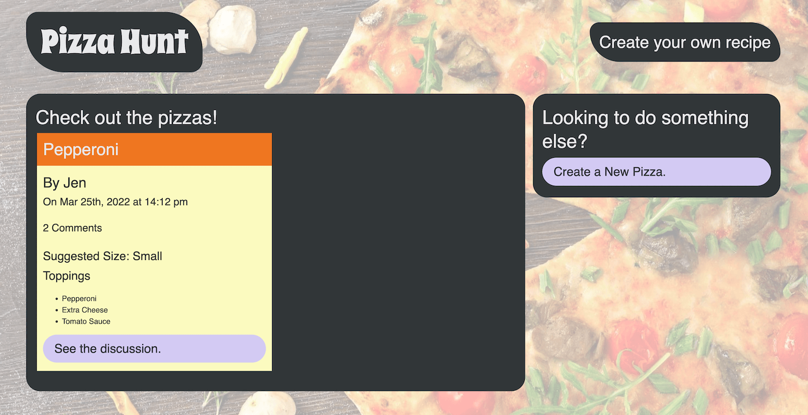
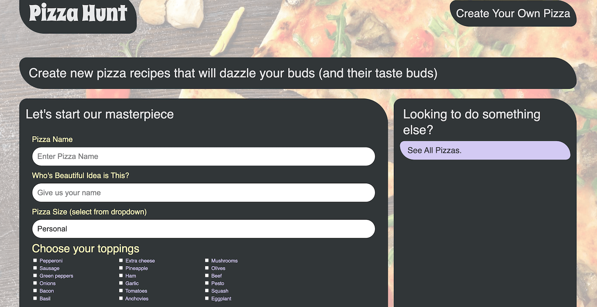
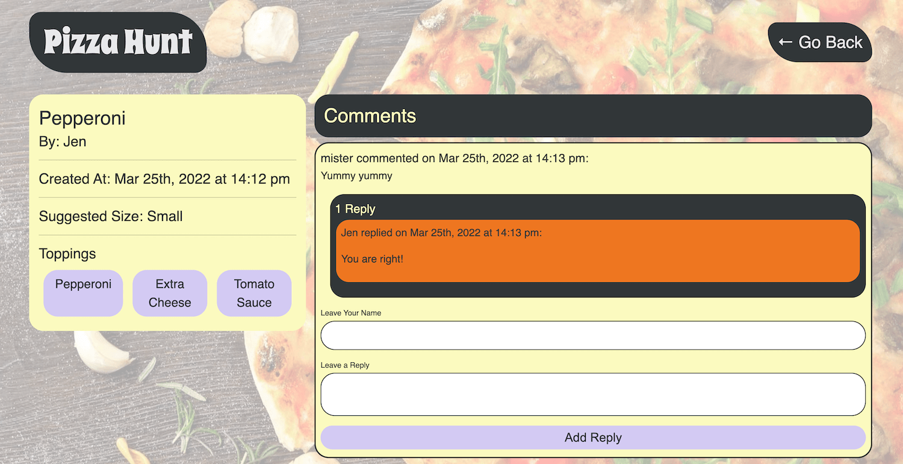

#   <h1 align="center"> Pizza Builder   </h1>

## Table of Contents
- [Description](#description)
- [Technologies](#technologies)
- [Installation](#installation)
- [Contributing](#contributing)
- [License](#license)
- [Questions](#questions)
## Description

  You can see the project repository <b> [here](https://github.com/mihaelavalac/pizza-builder). </b>  
  You can navigate to the deployed site <b> [here](https://mihaela-pizza-app.herokuapp.com/). </b> 

  
<i>The purpose of this application is to allow user to share different custom pizza with others. As well, an user can comment, and reply to a comment on a pizza recipe.</i>
 
  
AS A user who like pizza 
I WANT a CMS-style pizza site  
SO THAT I can publish pizza recipes and my thoughts about it.

## Technologies 
<li> Node.js/JavaScript.js </li> 
<li> HTML </li> 
<li> CSS  </li> 
<li> Express.js </li> 
<li> MongoDB || Mongoose </li>
<li> Heroku</li>
 

## Installation 

Follow the instructions to install this project on your local machine:   
1. Download and install Node.js and MongoDB to your computer.   
2. Clone the project repo to your computer `git clone git@github.com:mihaelavalac/pizza-builder.git`   
3. Navigate to the root of the project through your text editor.   
4. Open terminal and run the following command `npm i` to install the npm dependencies   
5. Run the `npm start` to start the app   
6. Navigate to the `http://localhost:3001/`.   
7. You should see the home page like bellow.      
8. Click the `Create a New Pizza` button to be redirected to the recipe page where you can create a pizza.   

  OR, click the `See The Discussion` button to be redirected to the pizza page.   

## Contributing

To contribute to the project just fork and install it on your computer, add the desired features/changes and push it back to the git. I will review the changes and merge them in the main branch.  

<b>Current Contributors:</b>  
👪 Mihaela Valac

## License

This application is covered by the <b>[MIT](https://opensource.org/licenses/MIT)</b> license.

## Questions

For questions please contact me on:  

:octocat: Github: [mihaelavalac](https://github.com/mihaelavalac)  
✉️ Email: mihaelavalac@yahoo.com 